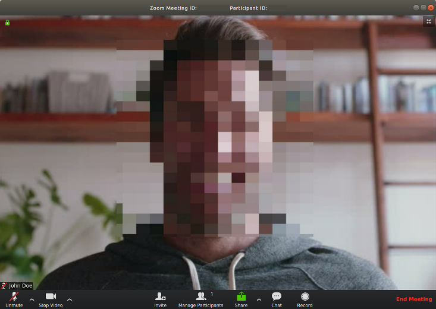

# Cameo

This project allows to apply filters while using your computer's webcam. It can
be used with any third party live streaming or video chat applications (eg.
Zoom, Hangout, Skype, etc.) by selecting the virtual video device as your webcam
device.



Current set of filters available through keyboard keys:

- face blurring (`b`)
- reactions (`a`, `)`)
- text (`t`)


##  Requirements

```shell
sudo apt install v4l2loopback-dkms python3-opencv python3-construct
```


## Usage

```shell
sudo modprobe v4l2loopback exclusive_caps=1
./cameo.py
```


## Miscellaneous commands

- List available webcams: `v4l2-ctl --list-devices`
- List supported formats: `v4l2-ctl --list-formats`
- Display a webcam with VLC: `vlc v4l2:///dev/video1`
- Stream a MP4: `ffmpeg -re -i /tmp/video1.mpeg -f v4l2 /dev/video1`
